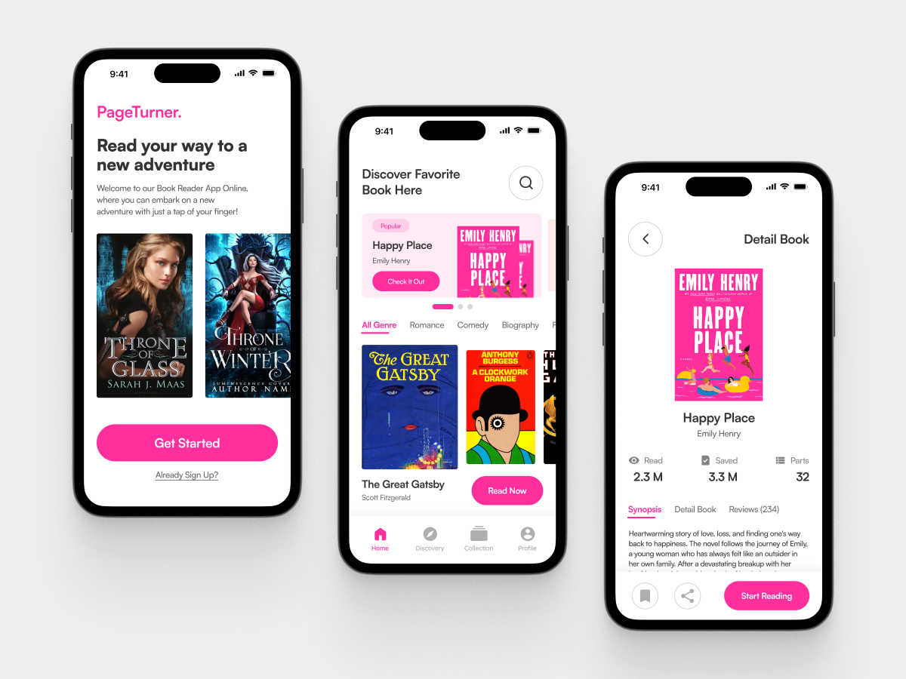

# EstateApp
Flutter UI Örnekleri
## Projenin Amacı
Bu projenin amacı **MVC** ve **OOP** kullanarak bir UI'ın Flutter'da klonlanmasıdır.
## Tasarım

## Ekran Görüntüleri

### Page1,Page2
, 

### Page3
, 

